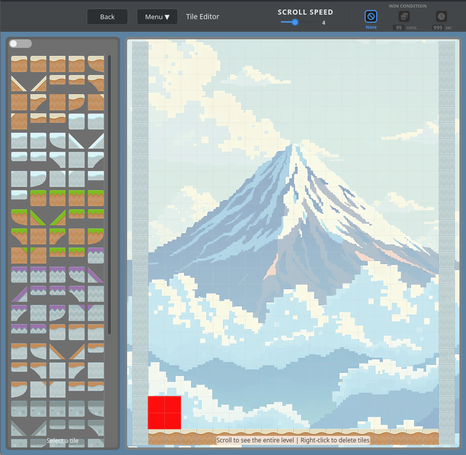
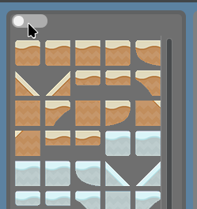
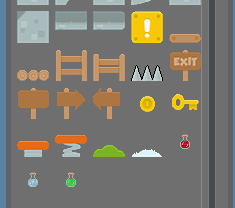
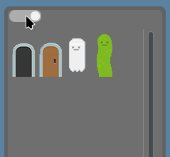
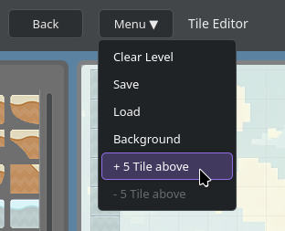
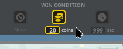
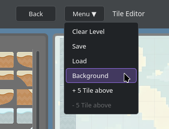

[[_TOC_]]

# Überblick

Der Editor ist in `qml/LevelEditor.qml` umgesetzt und wird von `LevelEditorController` gesteuert.

Aufbau:

- Links: `TilesetPalette` (Tile-Auswahl)
- Rechts: `LevelCanvas` (Level-Fläche)
- Oben: Toolbar (Save/Load/Clear/Background/Rows/Goal/ScrollSpeed)

{width=307 height=300}

# Grund-Workflow

1. `LevelEditor` im Hauptmenü starten.
2. Tile links auswählen.
3. Auf der rechten Canvas platzieren.
4. Mit `Save` speichern (XML + H5).

# Bedienung

- Linksklick auf Canvas: Tile setzen
- Rechtsklick auf Canvas: Tile löschen
- Rahmen-Tiles (Rand) sind geschützt
- Spawnbereich des Spielers (rotes 2x2 Feld unten links) ist geschützt

# Tile-Sets

Es gibt zwei Modi:

**Normal (`1x1` Tiles)**.
Hier findet man die Blöcke, auf denen der Spieler stehen kann.
Wer bis nach unten scrollt, findet dort ebenso spezielle Tiles, wie Münzen, Tränke und Sprungfedern.

{width=187 height=198}

{width=177 height=156}

**Extra (`1x2` Tiles)**, über Switch aktivierbar.
Hier werden zusammengehörende Tile-Paare gesetzt/entfernt.
Dabei handelt es sich zur Zeit hauptsächlich um Tore und Gegner.

{width=180 height=166}

# Level-Höhe

Die Höhe des Levels kann über das Menü erhöht oder verringert werden:

- `+ 5 Tile above`: fügt oben 5 Reihen hinzu
- `- 5 Tile above`: entfernt oben Reihen (Minimum Höhe bleibt 25)

{width=234 height=190}

# Win-Condition und Scroll-Speed

In der Top-Leiste:

- Scroll-Speed (Slider, intern Faktor 4)
- Zieltyp:
  - None
  - Coins (mit Wert)
  - Time (mit Sekundenwert)

{width=158 height=63}

Falls beim Coin-Ziel der eingetragene Wert höher als die Anzahl der im Level vorhandenen Coins eingestellt sein sollte, so wird er beim Speichern automatisch auf die im Level vorhandenen Coins begrenzt.

# Hintergrund

`Background` erlaubt die Auswahl eines Bildes aus:

- `res/images/backgrounds/`

{width=258 height=198}

Der Hintergrundpfad wird in XML als `background_path` gespeichert.
Wenn weitere Bilder dem Ordner hinzugefügt werden, müssen diese ebenfalls in `res/assets.qrc` hinzugefügt werden, um verwendet werden zu können.

# Save/Load

`Save` erzeugt die beiden folgenden Dateien:

- `levelname.xml`
- `levelname.h5`

Bei `Load` wird die xml eines gespeicherten Levels ausgewählt und in den Leveleditor geladen.
Dazu muss ebenso eine passende HDF5 (.h5) Datei im selben Ordner vorhanden sein.
Die geladenen Daten teilen sich wie folgt auf:

- XML-Metadaten: Goal, Tilegrößen, Hintergrund etc.
- HDF5-Daten: Tiles + Texturen.