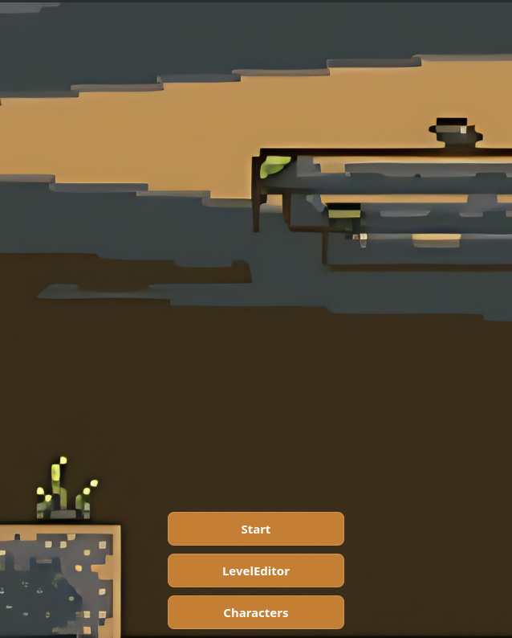
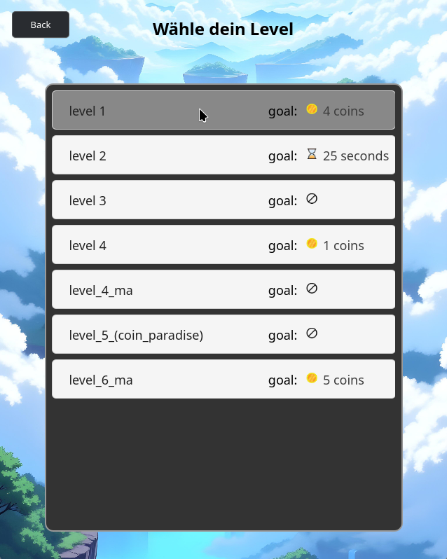
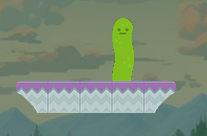
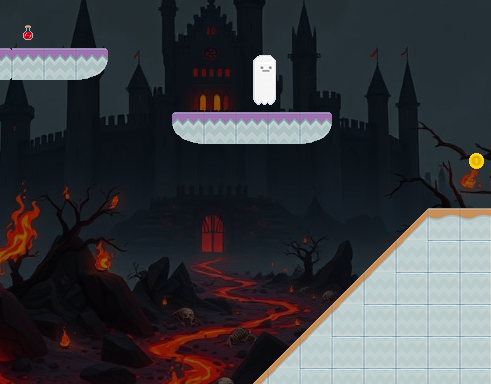
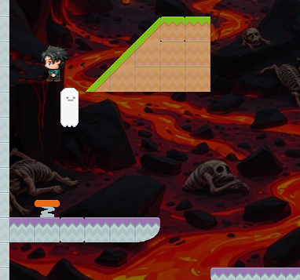
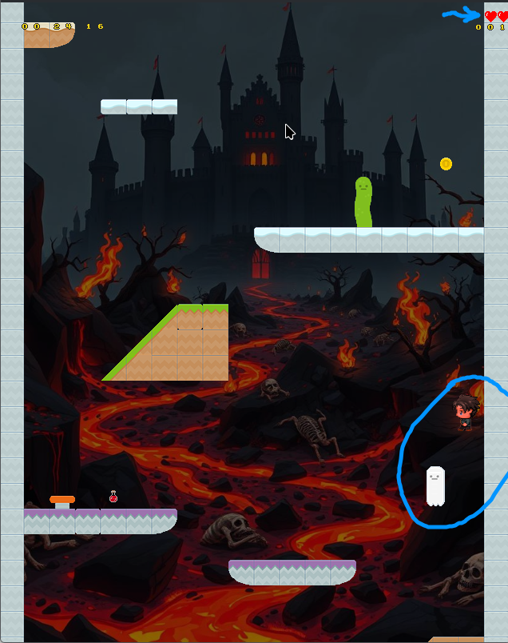
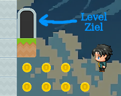
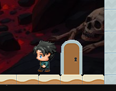
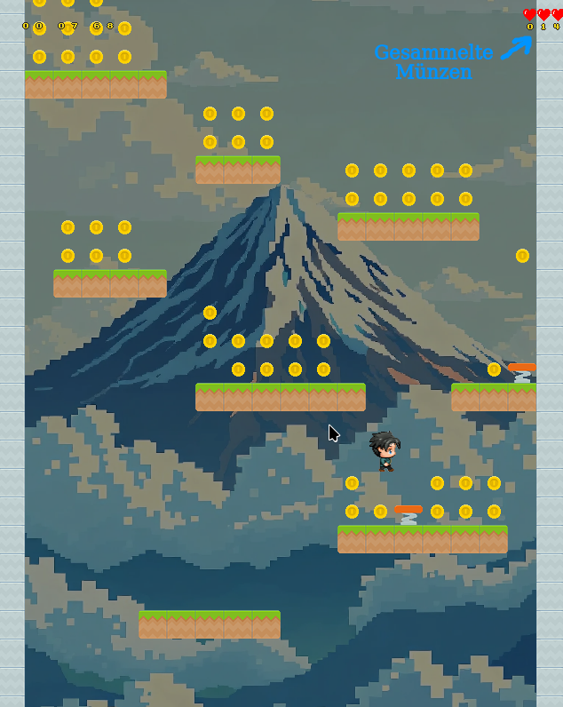
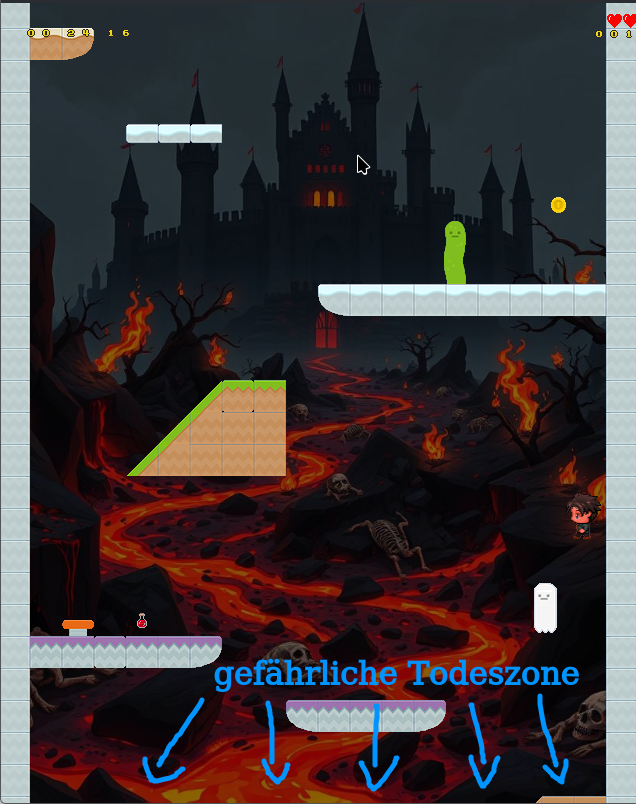

[[_TOC_]]

# Menü

Nach dem Start zeigt `Main.qml` drei Hauptpunkte:

- `Start`: Levelauswahl und Spielstart
- `LevelEditor`: Editor zum Erstellen/Bearbeiten von Levels
- `Characters`: Spielfigur auswählen

{width=235 height=295}

# Level starten

Klickt man im Hauptmenü auf den Punkt `Start`, so gelangt man zur Levelauswahl:

{width=235 height=295}

Dort werden alle Level angezeigt, welche unter dem Ordner `res/*.xml` zu finden sind (außer `level_master.xml`).
Klickt man nun den Namen eines Levels an, so wird das Spiel in `LevelStarter.qml` im `GameView` gestartet.

## Steuerung im Spiel

- `Pfeil links/rechts`: Laufen
- `Leertaste`: Springen
- `A`: Figur nach links ausrichten
- `D`: Figur nach rechts ausrichten
- `P`: Pause
- `ESC`: Zurück zur vorherigen Seite

## Gegner

Im Spiel kann man Gegnern begegnen.

Die zu findenden Arten sind der Geist und die Schlange (die mehr wie eine Gurke aussieht).

Die Schlange bewegt sich von links nach rechts über den Boden, auf dem sie steht.

{width=156 height=102}

Der Geist schwebt von links nach rechts durch die Luft.

{width=369 height=288}

Sobald er jedoch den Spieler bemerkt, fängt er an, ihn zu verfolgen.

{width=287 height=268}

Glücklicherweise lässt er jedoch nach einiger Zeit auch wieder ab.

Berührt man einen Gegner, so erleidet der Spieler Rückstoß und verliert einen Lebenspunkt, repräsentiert durch dir Herzen in der oberen rechten Ecke des Bildschirms.

{width=235 height=295}

## Ein Level abschließen

Um ein Level erfolgreich abzuschließen, ist es immer nötig, ein offenes Tor am Ende zu erreichen.

{width=200 height=159}

In den Leveldateien ist eine von drei Zieltypen definiert.
Je nach Konfiguration können weitere Bedingungen nötig sein, um ein Level erfolgreich abzuschließen:

- `0` (`GOAL_NONE`): Kein spezielles Ziel.
- `1` (`GOAL_COINS`): Genug Coins sammeln, um das Tor zu öffnen.
- `2` (`GOAL_TIME`): Ausgang vor Ablauf des Timers erreichen.

Sollte die Zielbedingung nicht erfüllt sein, bleibt das Tor geschlossen:

{width=200 height=159}

Die für den Zieltyp "Coins" benötigten Münzen kann man unterhalb der Lebenspunkte des Spielers sehen (auch in Leveln mit anderen Zieltypen).

{width=235 height=295}

## Game Over / Level Ende

Ein Game Over passiert durch folgende Bedingungen:

- Keine Lebenspunkte mehr übrig (HP <= 0)
- Zeitlimit überschritten (bei Zeit-Ziel)
- Spieler fällt in den kritischen unteren Kamerabereich

{width=235 height=295}

# Level Editor
Wählt man im Startmenü die Option `LevelEditor` aus, so gelangt man zum [Level-Editor](Level-Editor), welcher auf seiner eigenen Seite dokumentiert ist.

# Charakterauswahl

Wählt man im Menü `Characters` aus, so kommt man zur Charakterauswahl.

- Pfeile links/rechts wechseln die Figur.
- Beim Zurückgehen (`Back`) wird der Character in allen `res/*.xml` Leveldateien aktualisiert.