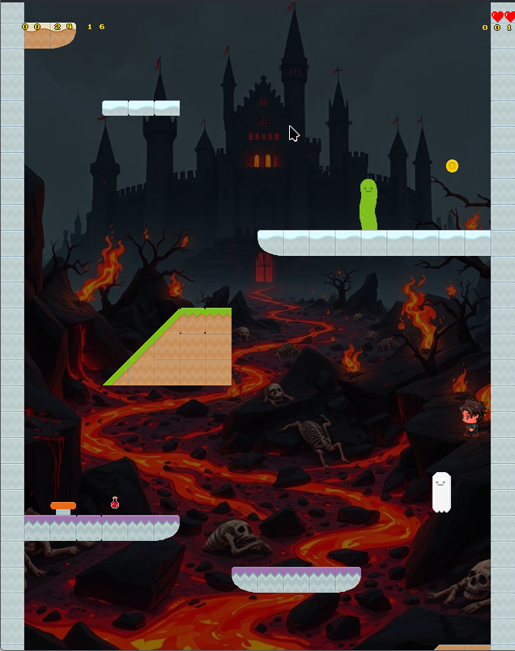

# Spielanleitung

## Menü

Nach dem Start zeigt `Main.qml` drei Hauptpunkte:

- `Start`: Levelauswahl und Spielstart
- `LevelEditor`: Editor zum Erstellen/Bearbeiten von Levels
- `Characters`: Spielfigur auswählen

{width=479 height=596}

## Level starten

Klickt man im Hauptmenü auf den Punkt `Start`, so gelangt man zur Levelauswahl:

{width=479 height=599}

Dort werden alle Level angezeigt, welche unter dem Ordner `res/*.xml` zu finden sind (außer `level_master.xml`).
Klickt man nun den Namen eines Levels an, so wird das Spiel in `LevelStarter.qml` im `GameView` gestartet.

### Steuerung im Spiel

- `Pfeil links/rechts`: Laufen
- `Leertaste`: Springen
- `A`: Figur nach links ausrichten
- `D`: Figur nach rechts ausrichten
- `P`: Pause
- `ESC`: Zurück zur vorherigen Seite

### Gegner

Im Spiel kann man Gegnern begegnen, wie bereits in Level Editor beschrieben.
Berührt man einen Gegner, so erleidet der Spieler Rükstoß und verliert einen Lebenspunkt, repräsentiert durch dir Herzen in der oberen rechten Ecke des Bildschirms.

{width=475 height=600}

### Ein Level abschließen

In den Leveldateien ist eine von drei Zieltypen definiert, welche nötig sind, um eine Level erfolgreich abzuschließen:

- `0` (`GOAL_NONE`): Kein spezielles Ziel, Ausgang erreichen.
- `1` (`GOAL_COINS`): Genug Coins sammeln, dann Ausgang nutzen.
- `2` (`GOAL_TIME`): Ausgang vor Ablauf des Timers erreichen.

### Game Over / Level Ende

Ein Game Over passiert durch folgende Bedingungen:

- Keine Herzen mehr (in der oberen, rechten Ecke des Bildschirms zu sehen)
- Zeitlimit überschritten (bei Zeit-Ziel)
- Spieler fällt in den kritischen unteren Kamerabereich

## Charakterauswahl

Wählt man im Menü `Characters` aus, so kommt man zur Charakterauswahl.

- Pfeile links/rechts wechseln die Figur.
- Beim Zurückgehen (`Back`) wird der Character in allen `res/*.xml` Leveldateien aktualisiert.